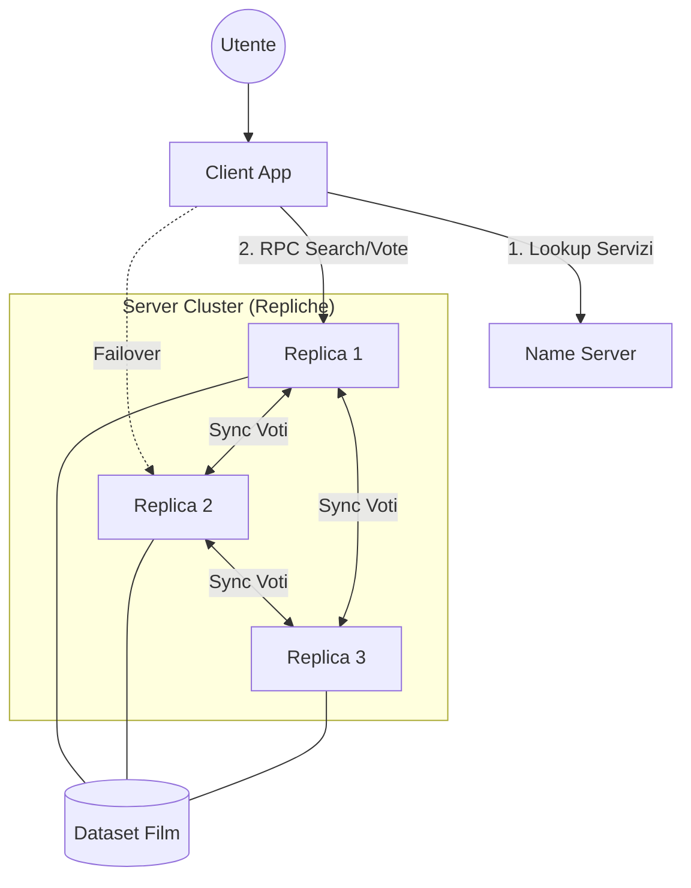

# Distributed Movie Search Engine

Progetto per l'esame di **Algoritmi Distribuiti (Modulo 3 CFU)**.
**Università degli Studi di Modena e Reggio Emilia (UNIMORE)**.
**Anno Accademico:** 2025/2026.

## Descrizione del Progetto

Questa applicazione implementa un motore di ricerca per film distribuito e tollerante ai guasti. Il sistema permette agli utenti di cercare film basandosi sulla trama (tramite algoritmi NLP **TF-IDF**) e di votare i propri preferiti.

Il progetto soddisfa i requisiti del modulo da 3 CFU:
* Sviluppo di un'applicazione distribuita.
* Utilizzo di tecnologie a oggetti distribuiti (**Pyro5**, analogo Python di Java RMI).
* Architettura ibrida Client-Server con replicazione Peer-to-Peer.

## Caratteristiche Architetturali

Il sistema è progettato come una **Replicated State Machine**:

1.  **Middleware RMI (Pyro5):** Gestisce la comunicazione trasparente tra i nodi e la serializzazione degli oggetti.
2.  **Tolleranza ai Guasti (Client-side Failover):** Il client interroga il Name Server per ottenere la lista delle repliche attive. Se una replica non risponde, il client tenta automaticamente la connessione con la successiva, garantendo la disponibilità del servizio.
3.  **Sincronizzazione (Eventual Consistency):**
    * **Avvio (Anti-entropy):** Quando una nuova replica si unisce alla rete, richiede lo stato attuale dei voti agli altri peer per allinearsi.
    * **Aggiornamento:** Quando un voto viene registrato, la replica lo salva su disco e propaga l'aggiornamento agli altri nodi in background.
4.  **Ricerca Semantica:** Utilizza `scikit-learn` per calcolare la similarità del coseno tra la query dell'utente e le trame dei film.

### Diagramma Architetturale (con 3 repliche)



## Requisiti e Installazione

### Prerequisiti

* **Python 3.8+**
* Librerie richieste:
```bash
pip3 install Pyro5 pandas numpy scikit-learn
```

* **Dataset:** Scaricare il file `tmdb_5000_movies.csv` (da [Kaggle](https://www.kaggle.com/datasets/tmdb/tmdb-movie-metadata?select=tmdb_5000_movies.csv)) e posizionarlo nella cartella principale.

### Setup Iniziale

Prima di avviare i server, è necessario inizializzare il database vettoriale e il modello NLP:

```bash
python3 setup_data.py
```

*Output:* Genera `server_db.pkl` (condiviso dalle repliche) e `client_model.pkl` (usato dal client per vettorizzare le query).

## Esecuzione

Per testare l'architettura distribuita, apri **tre o più terminali** separati.

#### 1. Avvio del Name Server (Terminale 1)

Il registro centrale per la service discovery.

```bash
python3 -m Pyro5.nameserver
```

#### 2. Avvio delle Repliche (Terminali 2 e 3)

Puoi avviare quante repliche desideri. Ognuna deve avere un nome univoco.

*Terminale 2:*

```bash
python3 server.py replica_A
```

*Terminale 3:*

```bash
python3 server.py replica_B
```

É possibile avviare un server anche utilizzando il comando:
```bash
python3 server.py
```
che attiverà una replica con un nome di default.

*Nota: Le repliche rileveranno automaticamente la presenza degli altri peer e sincronizzeranno i voti esistenti.*

#### 3. Avvio del Client (Terminale 4)

L'interfaccia utente per cercare e votare.

```bash
python3 client.py
```

## Testing

Il progetto include una suite di unit test per verificare la logica di business, la gestione dei file e la resilienza agli errori di rete (tramite Mocking).

Per eseguire i test:

```bash
python3 -m unittest test.py
```

## Struttura dei File

* `setup_data.py`: Preprocessing dei dati, creazione della matrice TF-IDF.
* `server.py`: Nodo server. Gestisce le richieste RPC, la persistenza dei voti (`votes_X.json`) e la propagazione degli aggiornamenti agli altri peer.
* `client.py`: Client RMI. Gestisce l'input utente, la connessione dinamica alle repliche e la gestione degli errori di connessione.
* `test.py`: Unit tests con `unittest` e `mock`.
* `tmdb_5000_movies.csv`: Dataset di input (non incluso nel version control).

